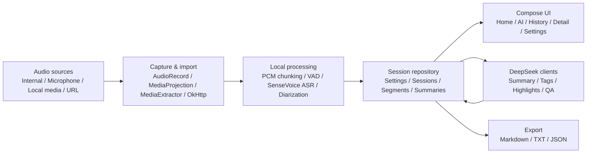

<a id="readme-top"></a>

<div align="center">

# Podcast Recap Local ASR

**端侧播客录音、转写与复盘工具。**

把系统内录、麦克风录音、本地媒体和 URL 媒体转成可检索的播客笔记，并在隐私边界清晰的前提下生成摘要、标签、高光和单期问答。

[](#技术栈)
[](#技术栈)
[](#技术栈)
[](https://github.com/zhitongliu061115-cpu/BlogRecording/actions/workflows/change-quality-gate.yml)
[](#许可证)

[快速开始](#快速开始) ·
[功能亮点](#功能亮点) ·
[架构](#架构) ·
[隐私边界](#隐私边界) ·
[开发流程](#开发流程)

</div>

---

## 目录

- [项目概览](#项目概览)
- [功能亮点](#功能亮点)
- [运行效果](#运行效果)
- [架构](#架构)
- [技术栈](#技术栈)
- [快速开始](#快速开始)
- [模型与依赖资产](#模型与依赖资产)
- [隐私边界](#隐私边界)
- [测试与质量门禁](#测试与质量门禁)
- [项目结构](#项目结构)
- [开发流程](#开发流程)
- [路线图](#路线图)
- [许可证](#许可证)

## 项目概览

Podcast Recap Local ASR 是一个 Android Kotlin + Jetpack Compose 应用骨架，面向“听播客、录播客、复盘内容”的本地优先工作流。

它把音频采集、端侧语音处理、会话持久化、AI 总结和导出组织成一条完整链路：

1. 通过系统内录、麦克风、本地音视频文件或 URL 导入创建播客会话。
2. 在本机完成音频切片、VAD、SenseVoice 转写和说话人分离标注。
3. 只把转写文本、时间戳和说话人标签发送给 DeepSeek，用于摘要、标签、高光和问答。
4. 将最终结果保存为结构化会话，可在详情页复制、追问或导出。

## 功能亮点

| 能力 | 当前状态 | 说明 |
| --- | --- | --- |
| 播客会话管理 | 可用 | 新建、重命名、暂停、续录、完成、历史详情 |
| 音频来源 | 可用 | 系统内录、麦克风录音、本地音视频导入、URL 导入 |
| URL 导入 | 可用 | 支持小宇宙单集链接、直链媒体、RSS/XML enclosure |
| 端侧转写 | 已接入骨架 | SenseVoice sherpa-onnx 模型随 APK assets 安装到私有目录 |
| VAD | 已接入骨架 | Silero VAD assets 校验与状态展示 |
| 说话人分离 | 已接入骨架 | speaker segmentation / embedding assets 校验与标签展示 |
| AI 摘要 | 可用 | DeepSeek 生成概览、要点、行动项、开放问题、金句候选和时间线章节 |
| 单期问答 | 可用 | 基于当前会话内容追问，支持失败重试 |
| 导出 | 可用 | Markdown、TXT、JSON |
| 隐私提示 | 可用 | 首次启动隐私弹窗、设置页模型状态和 API Key 状态 |

## 运行效果

当前仓库没有提交真实截图，README 不引用不存在的图片。核心界面包括：

- 首页：播客卡片、录音控制、导入入口、模型状态、处理阶段反馈。
- AI：选择已有播客后进入对话，围绕单期内容追问。
- 详情：转写、结构化摘要、标签、高光、问答历史、导出菜单。
- 设置：DeepSeek API Key、本地模型状态、VAD/说话人分离和摘要偏好。

## 架构



### 模块分层

```text
app/src/main/java/com/example/blogrecording/
  audio/          音频采集、PCM 流、切片、重采样、静音检测
  asr/            SenseVoice 识别与转写片段组装
  common/         Result、错误模型、协程调度、日志
  data/           设置、会话、模型资产、JSON 编解码与恢复
  diarization/    说话人分离、标签与 profile 管理
  export/         Markdown / TXT / JSON 导出
  importing/      本地媒体与 URL 媒体导入
  qa/             单期问答 prompt 与 DeepSeek 客户端
  recording/      分段录音控制器
  security/       API Key 本地加密存储
  service/        前台录音服务与通知状态
  summary/        摘要、标签、高光、时间线章节
  ui/             Compose 页面、状态映射与导航
  vad/            VAD 模型与语音片段
```

## 技术栈

- Android Gradle Plugin `9.0.1`
- Kotlin `2.0.21`
- Jetpack Compose + Material 3
- AndroidX DataStore Preferences
- Kotlin Coroutines
- OkHttp
- sherpa-onnx Android AAR
- SenseVoice / Silero VAD / speaker diarization ONNX assets
- DeepSeek Chat Completions API
- JUnit + AndroidX Instrumentation Test
- OpenSpec + GitHub Actions quality gate

## 快速开始

### 环境要求

- JDK 21
- Android SDK，compileSdk `36`
- Windows PowerShell 或兼容 Gradle Wrapper 的终端
- 可用的 Android 设备或模拟器
- 如需 AI 摘要/问答，在 App 设置页填入 DeepSeek API Key

### 克隆与构建

```powershell
git clone https://github.com/zhitongliu061115-cpu/BlogRecording.git
cd BlogRecording
.\gradlew.bat testDebugUnitTest
.\gradlew.bat :app:assembleDebug
```

Debug APK 输出位置：

```text
app/build/outputs/apk/debug/app-debug.apk
```

### 安装到设备

```powershell
.\gradlew.bat installDebug
```

首次启动时，应用会把 APK assets 中的模型复制到 App 私有目录，并在设置页展示加载状态。

## 模型与依赖资产

构建前必须存在真实模型和 AAR 文件。Gradle 已注册 `verifyBundledModels`，缺少或为空会导致 `preBuild` 失败，避免生成不可用 APK。

```text
app/libs/sherpa-onnx-static-link-onnxruntime-1.13.2.aar
app/src/main/assets/models/sensevoice/model.int8.onnx
app/src/main/assets/models/sensevoice/tokens.txt
app/src/main/assets/models/vad/silero_vad.onnx
app/src/main/assets/models/diarization/segmentation.onnx
app/src/main/assets/models/diarization/embedding.onnx
```

资产管理建议：

- 私有仓库可使用 Git LFS 管理 `.onnx` 与 `.aar`。
- 公开仓库发布前，应确认第三方模型与 AAR 的许可证允许分发。
- 不要用空文件或占位文件绕过 `verifyBundledModels`。

## 隐私边界

这个项目按“音频本地处理，文本可选云端总结”设计。

| 数据类型 | 处理位置 | 说明 |
| --- | --- | --- |
| 原始音频、PCM、音频片段 | 本机 | 不上传 |
| 声纹向量、speaker embedding | 本机 | 不上传 |
| API Key | 本机 | Android Keystore + AES/GCM 加密后保存 |
| 转写文本、时间戳、说话人标签 | 可发送给 DeepSeek | 仅用于摘要、标签、高光与问答 |
| 导出文件 | 用户选择的位置 | 支持保存或分享 |

## 测试与质量门禁

常用本地检查：

```powershell
git status --short
git diff --check
.\gradlew.bat testDebugUnitTest
.\gradlew.bat :app:assembleDebug
```

完整 harness：

```powershell
.\scripts\harness.ps1 -Change <openspec-change-id>
```

有设备或模拟器时，可追加连接测试：

```powershell
.\scripts\harness.ps1 -Change <openspec-change-id> -ConnectedAndroidTest
```

GitHub Actions workflow 位于：

```text
.github/workflows/change-quality-gate.yml
```

它会执行 OpenSpec validate、Gradle clean、Debug APK 构建、单元测试、Android lint，并上传 APK、测试报告、lint 报告和手动 QA 清单。

## 项目结构

```text
.
├── app/                         Android App 模块
│   ├── libs/                    sherpa-onnx AAR
│   └── src/
│       ├── main/                Kotlin 源码、Compose UI、Manifest、assets
│       ├── test/                JVM 单元测试
│       └── androidTest/         Android instrumentation tests
├── docs/                        Git 与 SDD/Harness 规范
├── gradle/                      Wrapper 与版本目录
├── openspec/                    规格驱动开发变更与 specs
├── scripts/harness.ps1          本地质量门禁脚本
├── build.gradle.kts
├── settings.gradle.kts
└── README.md
```

## 开发流程

本仓库使用 OpenSpec 管理需求与变更。涉及功能、权限、网络、模型、存储或安全边界的修改，建议先创建或更新：

```text
openspec/changes/<change-id>/
  proposal.md
  design.md
  tasks.md
  specs/
```

推荐提交前检查：

```powershell
git status --short
git diff --check
git diff --stat
.\gradlew.bat testDebugUnitTest
.\gradlew.bat :app:assembleDebug
```

提交前请确认：

- 不提交 `local.properties`、证书、Token、API Key 或个人路径。
- 不提交真实用户录音、转写文本、摘要内容或调试日志。
- 涉及行为变化时同步补充或更新测试。
- 涉及权限、网络、模型或密钥存储时，在 PR 中说明隐私和安全影响。

## 路线图

- [ ] 补充真实设备截图或 GIF，展示首页、AI 问答、详情导出流程。
- [ ] 完善 sherpa-onnx 原生识别链路的端到端验收记录。
- [ ] 扩展 URL 导入来源和失败提示。
- [ ] 强化长音频分片转写的恢复能力和进度展示。
- [ ] 为关键 Compose 流程补充更多 instrumentation tests。

## 许可证

本项目核心的端侧转写与复盘代码完全开源免费，并基于 [Apache License 2.0](LICENSE) 许可证分发。

我们秉持 **Community over Code** 的社区文化。您可以自由地使用、修改、分发本项目的代码，甚至将其应用于商业项目。根据 Apache 2.0 的规定，您只需满足以下基本条件：
1. **附带许可证：** 重新分发软件时，必须包含原有的 Apache 2.0 许可证副本。
2. **声明变更：** 若您修改了核心代码，需在被修改的文件中附带明确的修改声明。
3. **保留署名：** 请保留原作者的版权声明、专利声明及归属信息。

*让每一次倾听都有回响——隐私归你，知识沉淀。*

<div align="center">

如果这个项目帮你把播客内容变成了更可用的知识资产，欢迎 star、提 issue 或按 OpenSpec 流程提交 PR。

[回到顶部](#readme-top)

</div>
